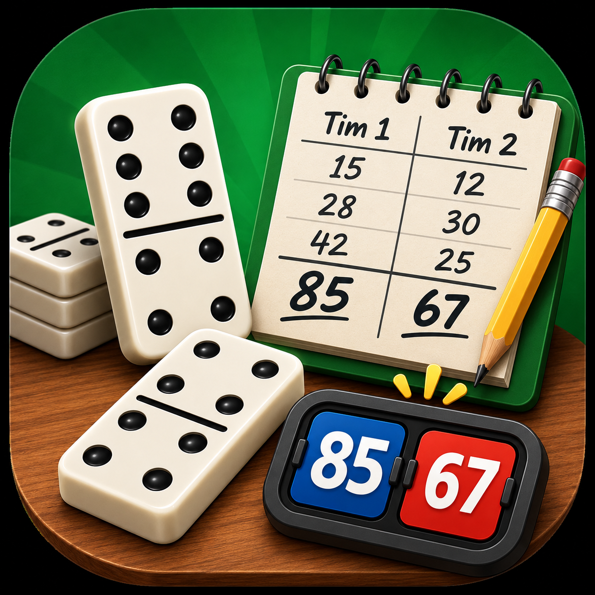

# 🁢 Skor Gaple

Aplikasi Flutter **offline** untuk menghitung skor pertandingan gaple (domino) antara 2 tim — tanpa perlu koneksi internet, tanpa backend.

<p align="left">
  
</p>

## ✨ Fitur

- **Hitung skor otomatis** — cukup input poin masuk tiap giliran, aplikasi yang menjumlahkan.
- **Riwayat poin** — setiap poin yang masuk tersimpan sebagai daftar, bisa **diedit** atau **dihapus** kalau salah input (lengkap dengan tombol urungkan).
- **Aturan menang otomatis** — ronde berakhir saat salah satu tim mencapai 101 poin:
  - Lawan masih ada poin → tim pemenang **+1** skor pertandingan.
  - Lawan masih kosong (0 poin) → tim pemenang langsung **+2** skor pertandingan.
- **Mode gelap & terang** — bisa diganti kapan saja, pilihan tersimpan otomatis.
- **Lanjutkan pertandingan** — progress tersimpan otomatis, jadi kalau aplikasi ditutup bisa dilanjut kapan saja, atau mulai baru dari awal.
- **Halaman Panduan** — penjelasan aturan main langsung di dalam aplikasi.
- **Halaman Apa yang Baru** — rangkuman perubahan/update aplikasi.
- **Terkunci mode portrait** — tampilan tetap konsisten, tidak bisa landscape.
- 100% **offline**, tidak ada iklan, tidak ada backend/server.

## 🎮 Aturan Singkat Gaple

1. Kedua tim saling menambah poin masuk tiap giliran.
2. Ronde berakhir begitu salah satu tim mencapai **101 poin**.
3. Skor pertandingan bertambah:
   - **+1** jika tim yang kalah sempat kemasukan poin.
   - **+2** jika tim yang kalah masih kosong (gaple) saat ronde berakhir.
4. Ronde baru dimulai lagi dari 0, skor pertandingan terus terakumulasi sampai kalian selesai bermain.

## 🛠️ Tech Stack

- [Flutter](https://flutter.dev) & Dart
- [`shared_preferences`](https://pub.dev/packages/shared_preferences) — menyimpan progress pertandingan & preferensi tema secara lokal di perangkat
- [`flutter_launcher_icons`](https://pub.dev/packages/flutter_launcher_icons) — generate icon aplikasi

## 📂 Struktur Folder

```
lib/
├── main.dart                  # Entry point aplikasi
├── models/
│   ├── team.dart               # Model Team & PointEntry (riwayat poin)
│   └── game_controller.dart    # Logika aturan skor (target 101, bonus +1/+2)
├── services/
│   └── match_storage.dart      # Simpan/muat/hapus progress pertandingan
├── theme/
│   ├── app_colors.dart         # Palet warna (diambil dari icon aplikasi)
│   ├── app_theme.dart          # Definisi ThemeData terang & gelap
│   └── theme_controller.dart   # Kelola & simpan pilihan mode gelap/terang
└── screens/
    ├── home_screen.dart         # Input nama tim / lanjutkan pertandingan
    ├── game_screen.dart         # Layar utama permainan & riwayat poin
    ├── guide_screen.dart        # Halaman Panduan
    └── whats_new_screen.dart    # Halaman Apa yang Baru
```

## 🚀 Cara Menjalankan

1. Clone repository ini, lalu masuk ke foldernya:
   ```bash
   git clone <url-repo-kamu>
   cd gaple_score_app
   ```
2. Kalau folder `android/` atau `ios/` belum ada, generate dulu:
   ```bash
   flutter create .
   ```
3. Install dependency:
   ```bash
   flutter pub get
   ```
4. Generate icon aplikasi (opsional, hanya perlu sekali atau saat `assets/icon/icon.png` diganti):
   ```bash
   dart run flutter_launcher_icons
   ```
5. Jalankan aplikasinya:
   ```bash
   flutter run
   ```

### Build APK

```bash
flutter build apk --release
```
Hasil APK ada di `build/app/outputs/flutter-apk/app-release.apk`.

## 👤 Dibuat oleh

**Arneva**

---

Kontribusi, saran, dan laporan bug sangat diterima lewat [Issues](../../issues) 🙌
